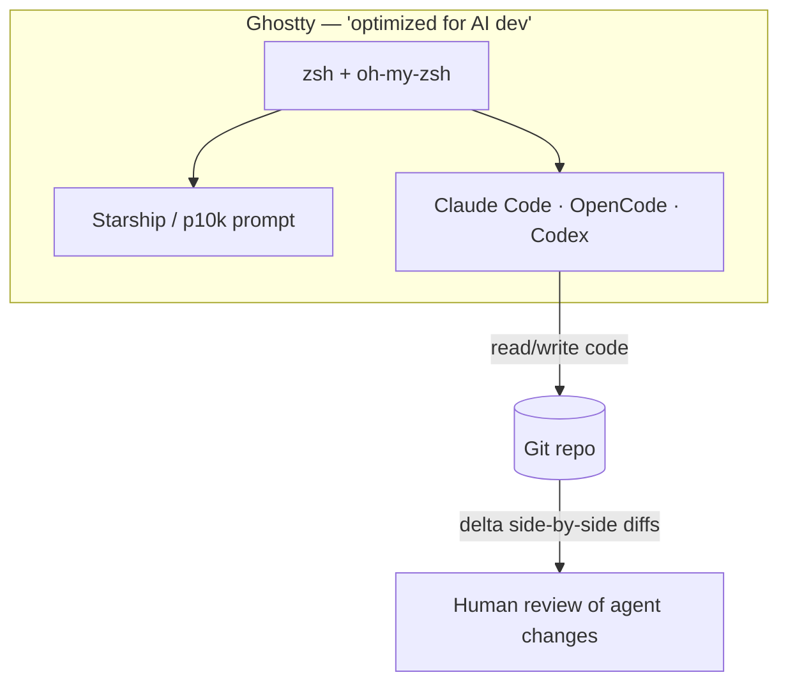
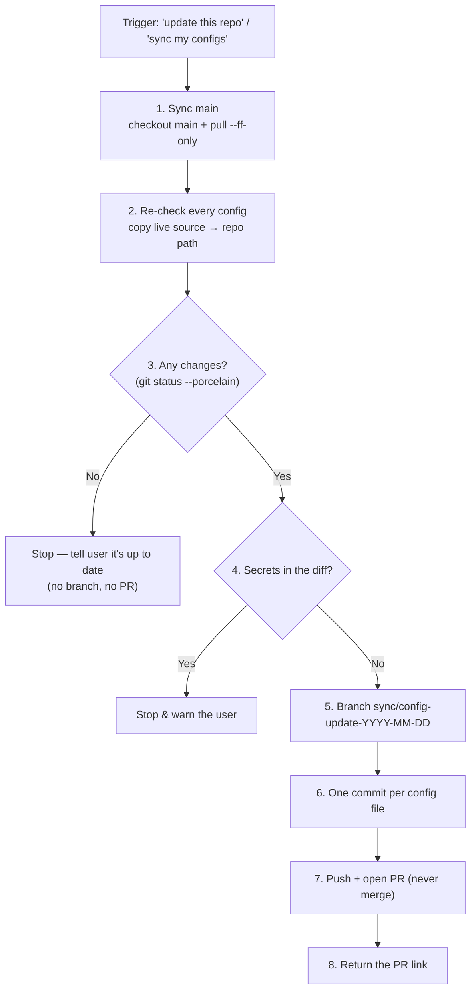

# Agentic Engineering Setup

---

## Brief

This is my setup for **agentic software engineering** — working *with* AI coding
agents rather than just autocomplete. The goal is an environment where an agent
can drive long, multi-step sessions comfortably: readable diffs, huge
scrollback, fast navigation, and configs that are versioned so the whole thing
is reproducible on a new machine.

Everything here lives in my dotfiles repo, symlinked into place. The configs are
the source of truth; a new machine is one `git clone` + a few `ln -sf` away from
identical.

> **Dotfiles repo:** [github.com/apk471/dotfiles](https://github.com/apk471/dotfiles)

---

## The agentic tools

| Tool | Role |
| --- | --- |
| **Claude Code** | Primary coding agent. Driven per-repo by a `CLAUDE.md` that encodes project context + repeatable workflows (see below). |
| **OpenCode** | Terminal-native agentic coding CLI. Config at `~/.config/opencode/opencode.jsonc`. |
| **Codex** | Additional coding assistant in the rotation. |

The common thread: they all run **in the terminal**, so the terminal itself is
the IDE — which is why it's tuned specifically for this.

---

## Context & token tooling

Add-ons that stretch the agent's context window and cut token spend — the
recurring bottleneck in long agentic sessions:

| Tool | What it does |
| --- | --- |
| [Context Mode](https://github.com/mksglu/context-mode) | MCP server that protects an agent's context window via sandboxed tool execution, persistent session memory, and routing enforcement across many agents (Claude Code, Cursor, Copilot, …). |
| [Context7](https://github.com/upstash/context7) | Feeds up-to-date, version-specific library docs + examples straight to the agent (MCP server, or CLI + Skills mode) — kills stale/hallucinated APIs. |
| **RTK** (Rust Token Killer) | Token-optimized CLI proxy — rewrites common dev commands (e.g. `git status`) to trim output, ~60–90% token savings on dev operations. |
| [code-review-graph](https://github.com/tirth8205/code-review-graph) | Local-first Tree-sitter map of the codebase; computes a change's "blast radius" so the agent reviews only affected files instead of the whole repo. |
| [caveman](https://github.com/JuliusBrussee/caveman) | Claude Code skill that compresses agent **output** ~65% via terse "caveman" phrasing while keeping code/technical accuracy intact. |

Common thread: all fight the same bottleneck — **context is finite and tokens
cost money/latency**, so the setup leans on tools that feed less, waste less,
and say less.

---

## The terminal, tuned for AI development

The [Ghostty](https://ghostty.org) config header literally reads *"Optimized for
AI Development — Claude Code • Codex • Go • Git • macOS"*. The choices that
matter for agentic work:

- **100k-line scrollback** — long agent sessions produce a lot of output; you
  need to scroll back through a whole run without losing the top.
- **`copy-on-select` + clipboard read/write** — frictionless copying of snippets
  and errors in and out of agent chats.
- **`shell-integration = detect`** — lets the terminal track prompts/commands.
- **GitHub Dark theme + JetBrainsMono Nerd Font, 15pt**, subtle background blur
  (opacity `0.78`) — readable for long stretches, with glyphs for prompt icons.
- **`window-save-state = always`** — sessions survive restarts.

---

## Shell, prompt & git

- **zsh** with **oh-my-zsh** (`git` plugin), **Starship** as the prompt (a custom
  `format` surfacing git branch/status, Go/Node/Python versions, Docker &
  Kubernetes context) with **Powerlevel10k** available too.
- **zoxide** for smart `cd`, **fzf** for fuzzy finding — both matter when an
  agent leaves you jumping around a big repo.
- Modern CLI replacements: **`eza`** (ls), **`bat`** (cat), **`lazygit`** (`lg`),
  plus short git aliases (`g`, `gs`, `ga`, `gc`, `gp`).
- **git + [delta](https://github.com/dandavison/delta)** as pager +
  `interactive.diffFilter`, with `side-by-side`, `line-numbers`, and `navigate`
  on. Agents generate a lot of diff; a good side-by-side pager makes reviewing
  what the agent changed fast and safe. (`git-lfs` and an SSH URL rewrite are
  configured too.)

---

## Codifying agent workflows in CLAUDE.md

A coding agent is only as reliable as the instructions it's given. Left to
"vibes", the same request produces different results each run. The high-leverage
move is to **codify repeatable tasks as deterministic procedures** in a repo's
`CLAUDE.md` — a checklist the agent follows the same way every time, with the
safety rails baked in. Each workflow gets a **trigger**, **ordered steps**,
**safety rails**, and **conventions**.

The dotfiles repo does exactly this with its **"update this repo"** workflow.
Trigger phrases: *"update this repo" / "sync my configs" / "back up my
dotfiles"*. When it fires, the agent runs a fixed procedure:

The principles that make it work:

| Principle | In the dotfiles workflow | Why it matters |
| --- | --- | --- |
| **Explicit triggers** | "update this repo" / "sync my configs" | The agent knows *when* to run it, not just how |
| **Deterministic steps** | Numbered 1–8, in order | Same result every run; reviewable |
| **Fail-safe exits** | Stop if nothing changed; stop if secrets found | Does nothing risky rather than guessing |
| **Human keeps the keys** | Push + open PR, **never merge** | Irreversible/outward actions stay with the user |
| **Consistent output** | One commit per file; dated branch | History stays clean and greppable |
| **Mechanical mappings** | Live-source → repo-path table | No ambiguity about *what* to copy where |

The general lesson: **treat your `CLAUDE.md` workflows like scripts an agent
executes** — precise enough to be safe, explicit enough to be repeatable. The
same shape works for releases, changelog updates, or any recurring repo task.

---

## Why version-control all of this

Two reasons that are specifically about *agentic* work:

1. **Reproducibility** — a new machine (or a cloud dev box an agent runs in) gets
   the exact same environment, so agent behavior is consistent.
2. **The backup is itself agent-operated** — the `CLAUDE.md` workflow above makes
   syncing configs a safe, repeatable agent task rather than manual copying.

Repo: **[github.com/apk471/dotfiles](https://github.com/apk471/dotfiles)**
