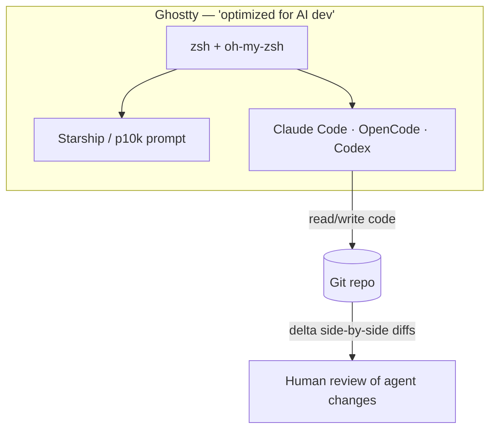
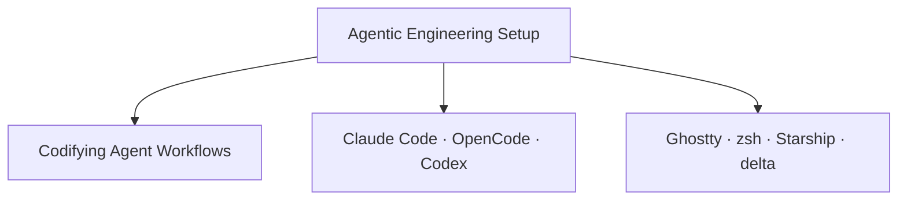

# Agentic Engineering Setup

---

## Brief

This is my setup for **agentic software engineering** — working *with* AI coding
agents rather than just autocomplete. The goal is an environment where an agent
can drive long, multi-step sessions comfortably: readable diffs, huge
scrollback, fast navigation, and configs that are versioned so the whole thing
is reproducible on a new machine.

Everything here lives in my [`dotfiles`](https://github.com/apk471/dotfiles)
repo, symlinked into place. The configs are the source of truth; a new machine
is one `git clone` + a few `ln -sf` away from identical.

---

## The agentic tools

| Tool | Role |
| --- | --- |
| **Claude Code** | Primary coding agent. Driven per-repo by a `CLAUDE.md` that encodes project context + repeatable workflows (see [Codifying Agent Workflows](/ai/codifying-agent-workflows)). |
| **OpenCode** | Terminal-native agentic coding CLI. Config at `~/.config/opencode/opencode.jsonc`. |
| **Codex** | Additional coding assistant in the rotation. |

The common thread: they all run **in the terminal**, so the terminal itself is
the IDE — which is why it's tuned specifically for this.

---

## The terminal, tuned for AI development

The [Ghostty](https://ghostty.org) config header literally reads *"Optimized for
AI Development — Claude Code • Codex • Go • Git • macOS"*. The choices that
matter for agentic work:

- **100k-line scrollback** — long agent sessions produce a lot of output; you
  need to scroll back through a whole run without losing the top.
- **`copy-on-select` + clipboard read/write** — frictionless copying of snippets
  and errors in and out of agent chats.
- **`shell-integration = detect`** — lets the terminal track prompts/commands.
- **GitHub Dark theme + JetBrainsMono Nerd Font, 15pt**, subtle background blur
  (opacity `0.78`) — readable for long stretches, with glyphs for prompt icons.
- **`window-save-state = always`** — sessions survive restarts.

---

## Shell & prompt

- **zsh** with **oh-my-zsh** (`git` plugin), **Starship** as the prompt (a custom
  `format` surfacing git branch/status, Go/Node/Python versions, Docker &
  Kubernetes context) with **Powerlevel10k** available too.
- **[zoxide](https://github.com/ajeddeloh/zoxide)** for smart `cd`, **fzf** for
  fuzzy finding — both matter when an agent leaves you jumping around a big repo.
- Modern CLI replacements: **`eza`** (ls), **`bat`** (cat), **`lazygit`** (`lg`),
  plus short git aliases (`g`, `gs`, `ga`, `gc`, `gp`).

---

## Git, tuned for reviewing agent diffs

The most important agentic-workflow choice in `.gitconfig` is the pager:

- **[delta](https://github.com/dandavison/delta)** as pager + `interactive.diffFilter`,
  with `side-by-side`, `line-numbers`, and `navigate` on. Agents generate a lot
  of diff; a good side-by-side pager makes reviewing what the agent changed fast
  and safe.
- `url."git@github.com:".insteadOf https://github.com/` — clone with HTTPS URLs,
  push over SSH automatically.
- `git-lfs` filters configured.

---

## Why version-control all of this

Two reasons that are specifically about *agentic* work:

1. **Reproducibility** — a new machine (or a cloud dev box an agent runs in) gets
   the exact same environment, so agent behavior is consistent.
2. **The backup is itself agent-operated** — the dotfiles repo has a `CLAUDE.md`
   that defines a precise "update this repo" workflow, so syncing configs is a
   safe, repeatable agent task rather than manual copying. That pattern is worth
   its own note.

---

## Concept Map

