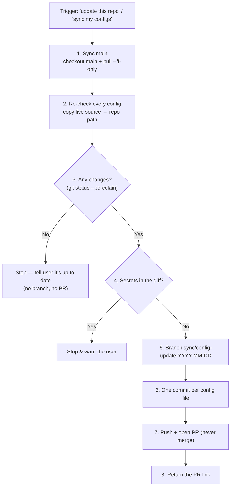
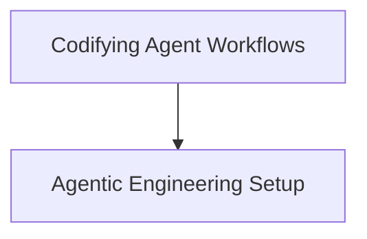

# Codifying Agent Workflows in CLAUDE.md

---

## Brief

A coding agent is only as reliable as the instructions it's given. Left to
"vibes", the same request produces different results each run. The fix is to
**codify repeatable tasks as deterministic procedures** in a repo's `CLAUDE.md`
— a checklist the agent follows the same way every time, with the safety rails
baked in.

This note uses a real example from my [`dotfiles`](https://github.com/apk471/dotfiles)
repo: the **"update this repo" workflow** that backs up my machine's configs.

---

## The idea

`CLAUDE.md` is context the agent reads before working in a repo. Beyond
describing *what the repo is*, the high-leverage move is to define **named
workflows** with:

- a **trigger** — the phrases that should invoke it,
- **ordered, unambiguous steps**,
- **safety rails** — the "stop and don't do X" conditions,
- **conventions** — how commits/branches/PRs should look.

This turns tribal knowledge ("remember to scan for secrets first") into
something the agent does automatically.

---

## Worked example: the dotfiles "update this repo" workflow

The trigger is explicit: *"update this repo", "sync my configs", "back up my
dotfiles"*. When it fires, the agent runs a fixed procedure:

A **source-of-truth mapping table** in the same `CLAUDE.md` tells the agent
exactly which live file maps to which repo path (e.g. `~/.zshrc` → `zsh/.zshrc`),
so step 2 is mechanical rather than guesswork.

---

## The principles behind it

| Principle | In the dotfiles workflow | Why it matters |
| --- | --- | --- |
| **Explicit triggers** | "update this repo" / "sync my configs" | The agent knows *when* to run the procedure, not just how |
| **Deterministic steps** | Numbered 1–8, in order | Same result every run; reviewable |
| **Fail-safe exits** | Stop if nothing changed; stop if secrets found | The agent does nothing risky rather than guessing |
| **Human keeps the keys** | Push + open PR, **never merge** | Outward-facing/irreversible actions stay with the user |
| **Consistent output** | One commit per file; dated branch name | Diffs and history stay clean and greppable |
| **Mechanical mappings** | Live-source → repo-path table | Removes ambiguity about *what* to copy where |

---

## Why this is worth doing

- **Reproducibility** — the workflow runs identically whether it's today or in
  six months, by me or by the agent alone.
- **Safety** — the dangerous steps (committing secrets, merging, destroying
  uncommitted work) are explicitly gated.
- **Less prompting** — I say four words ("sync my configs") instead of
  re-explaining the whole procedure each time.
- **Portable pattern** — the same shape (trigger → steps → rails → conventions)
  works for any repeatable repo task: releases, changelog updates, data syncs.

The general lesson: **treat your `CLAUDE.md` workflows like scripts an agent
executes** — precise enough to be safe, explicit enough to be repeatable.

---

## Concept Map

