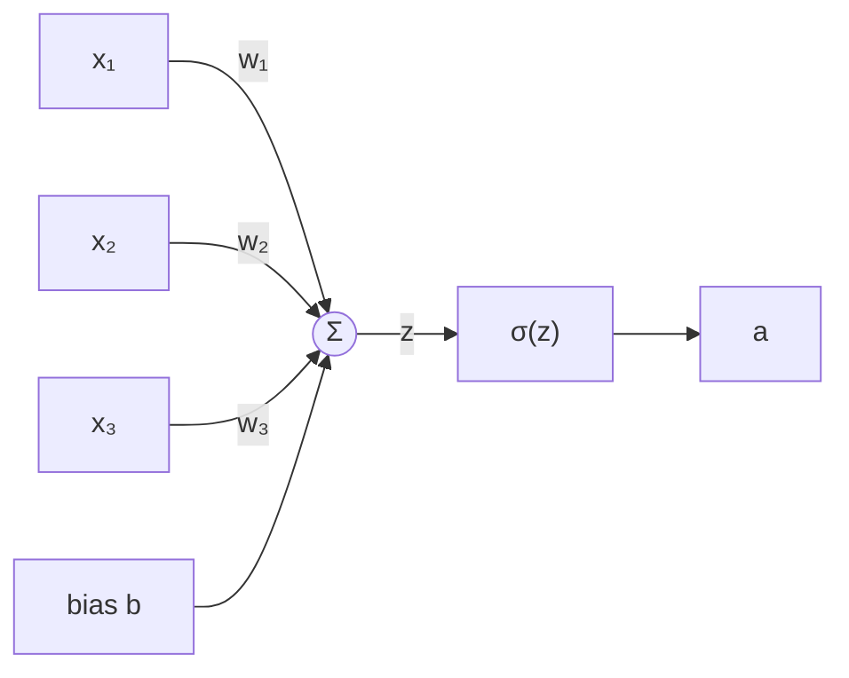
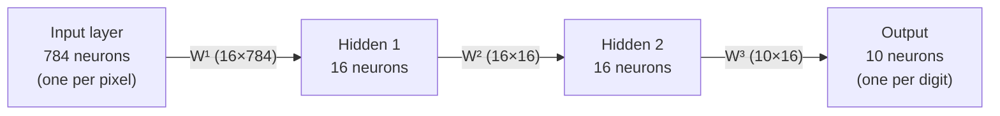
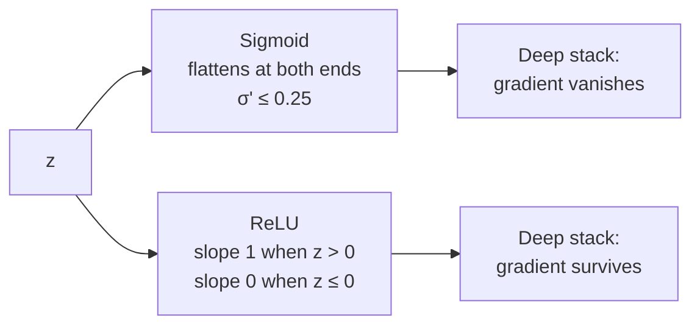
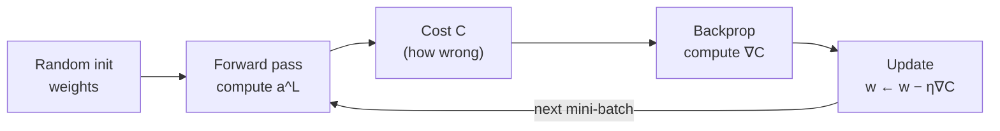
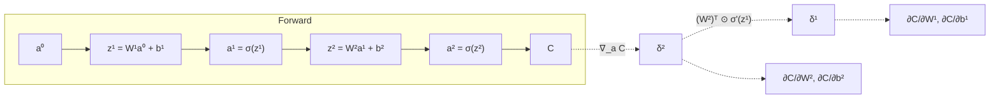
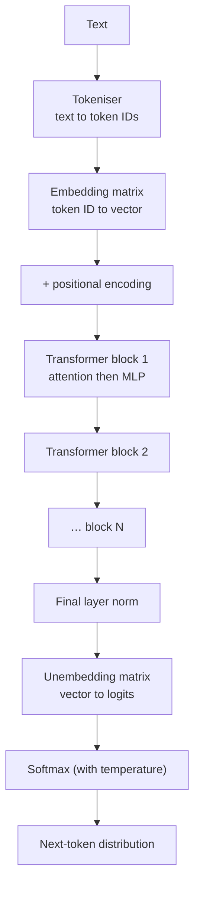
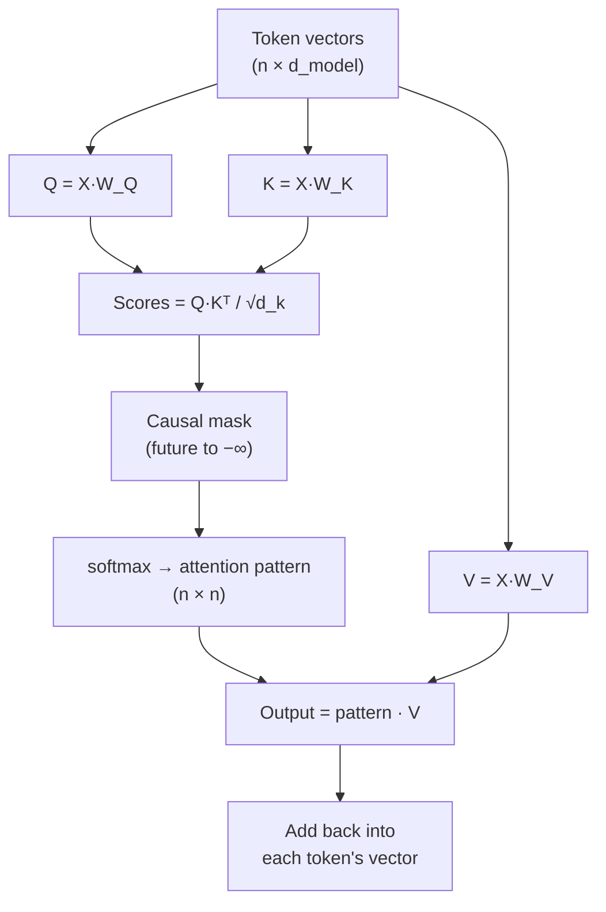
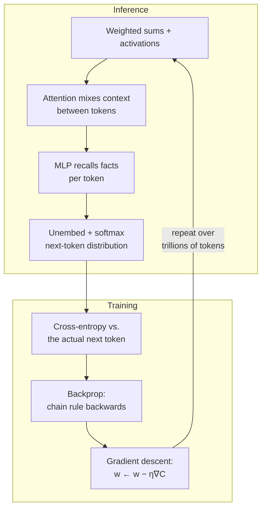

# Neural Networks and Transformers

Everything a language model does reduces to two operations repeated at scale: **multiply by a matrix**, then **squash the result through a non-linear function**. Training is the process of nudging those matrices until the output stops being wrong.

This note walks the whole path — a single neuron, a layer, a network, how it learns, and then how the transformer rearranges those same parts into something that predicts text. Notation is consistent throughout, and every formula has a legend.

---

## Notation

| Symbol | Meaning |
| --- | --- |
| `x` | Input vector to the network |
| `l` | Layer index, `1 … L` (`L` = output layer) |
| `a^l` | **Activations** of layer `l` — what the layer outputs |
| `z^l` | **Pre-activations** of layer `l` — the weighted sum, before the activation function |
| `W^l` | Weight matrix of layer `l`, shape `(n_l × n_{l-1})` |
| `b^l` | Bias vector of layer `l`, length `n_l` |
| `σ` | Activation function (sigmoid, ReLU, …) |
| `C` | Cost / loss — one number saying how wrong the network is |
| `η` | Learning rate — step size for gradient descent |
| `δ^l` | Error signal at layer `l` — `∂C/∂z^l` |
| `⊙` | Element-wise (Hadamard) product |
| `∇` | Gradient — vector of partial derivatives |

---

## Part 1 — The Neuron

A neuron takes several numbers, weighs each one, adds a bias, and squashes the result.

```text
z = w₁x₁ + w₂x₂ + … + wₙxₙ + b
a = σ(z)
```

| Term | Role |
| --- | --- |
| `xᵢ` | Input — a pixel, a feature, or the output of an earlier neuron |
| `wᵢ` | **Weight** — how much this input matters, and in which direction. Learned. |
| `b` | **Bias** — how high the weighted sum must climb before the neuron meaningfully fires. Learned. |
| `z` | Pre-activation, the raw weighted sum |
| `σ` | Activation, the non-linearity |
| `a` | Activation — the neuron's output |

The weighted sum alone is a **linear** function. Stack a hundred linear layers and you still have one linear function — algebra collapses them. The activation `σ` is what breaks that collapse and lets depth buy you anything.



---

## Part 2 — Layers as Matrix Multiplication

One neuron is a dot product. A layer of neurons is a **matrix multiply** — the same operation, batched:

```text
z^l = W^l · a^{l-1} + b^l
a^l = σ(z^l)
```

| Term | Shape | Meaning |
| --- | --- | --- |
| `a^{l-1}` | `n_{l-1} × 1` | Previous layer's activations (or the raw input, when `l = 1`) |
| `W^l` | `n_l × n_{l-1}` | Row `j` holds the weights of neuron `j` in this layer |
| `b^l` | `n_l × 1` | One bias per neuron |
| `z^l` | `n_l × 1` | Pre-activations |
| `a^l` | `n_l × 1` | Layer output |

This is why GPUs matter. The entire forward pass of a network is a chain of matrix multiplies, and matrix multiplication is the single operation GPUs are built to do thousands of at once.

### A concrete network

The classic handwritten-digit network: 784 inputs (a 28×28 image), two hidden layers of 16, and 10 outputs (one per digit).



Parameter count: `784·16 + 16` + `16·16 + 16` + `16·10 + 10` = **13,002 knobs**. Training means finding good values for all of them at once.

---

## Part 3 — Activation Functions

| Function | Formula | Range | Notes |
| --- | --- | --- | --- |
| **Sigmoid** | `σ(z) = 1 / (1 + e^(−z))` | (0, 1) | Smooth, interpretable as a probability. **Saturates**: for large \|z\| the slope is ≈ 0, so gradients vanish and learning stalls. Mostly historical inside deep nets. |
| **Tanh** | `tanh(z) = (e^z − e^(−z)) / (e^z + e^(−z))` | (−1, 1) | Zero-centred sigmoid. Same saturation problem. |
| **ReLU** | `ReLU(z) = max(0, z)` | [0, ∞) | Slope is exactly 1 for `z > 0`, so gradients pass through undamped. Cheap. The default for deep networks. |
| **GELU** | `GELU(z) ≈ z · Φ(z)` | ≈ [−0.17, ∞) | Smooth ReLU. What transformers actually use. |

The failure mode ReLU fixes is worth stating precisely: sigmoid's derivative peaks at 0.25 and approaches zero at both tails. Backpropagation multiplies these derivatives layer by layer, so across 20 layers you multiply 20 numbers each ≤ 0.25 — the gradient reaching the early layers is effectively zero, and those layers never learn. **Vanishing gradients.**

ReLU's derivative is 1 wherever the neuron is active, so nothing shrinks on the way back.



---

## Part 4 — Cost Functions

The network's output is compared against the truth, producing one number.

### Mean squared error

```text
C = (1/n) · Σ (a^L_i − y_i)²
```

Fine for regression. Poor for classification, because when paired with sigmoid it produces small gradients exactly when the network is confidently wrong — the worst time to learn slowly.

### Cross-entropy

The loss for probability outputs, and the one language models use:

```text
C = − Σ y_i · log(p_i)
```

| Term | Meaning |
| --- | --- |
| `y_i` | True label as a one-hot vector — 1 for the correct class, 0 elsewhere |
| `p_i` | Predicted probability for class `i` (comes out of softmax) |
| `log` | Natural log |

Because `y` is one-hot, the sum collapses to a single term: `C = −log(p_correct)`.

Read that literally:

| Probability assigned to the truth | Loss |
| --- | --- |
| 0.99 | 0.01 — nearly free |
| 0.50 | 0.69 |
| 0.10 | 2.30 |
| 0.01 | 4.61 — brutal |

Confident and wrong is punished sharply, and confident and right costs almost nothing. Paired with softmax, the gradient simplifies to `p − y` — clean, and it doesn't vanish when the network is badly wrong.

### Cost over the dataset

`C` above is the loss for **one** example. What training actually minimises is the average over all examples — a single scalar landscape over 13,002 (or 175 billion) dimensions.

---

## Part 5 — Gradient Descent

The gradient `∇C` is the vector of partial derivatives of the cost with respect to every weight and bias. It points in the direction of **steepest increase**, so you step the other way:

```text
w ← w − η · ∂C/∂w
b ← b − η · ∂C/∂b
```

| Term | Meaning |
| --- | --- |
| `η` | Learning rate. Too large overshoots and diverges; too small crawls. |
| `∂C/∂w` | How much the cost changes per unit change in that one weight |

Two things the gradient tells you, and the second is the one people miss:

1. **Direction** — which way to nudge each weight
2. **Priority** — the *magnitude* of each component says which weights matter most. A weight with a large partial derivative is one where a small change buys a big improvement.

### Batch, stochastic, mini-batch

| Variant | Gradient computed over | Trade-off |
| --- | --- | --- |
| **Batch** | The entire training set | Accurate gradient, unusably slow per step |
| **Stochastic (SGD)** | One example | Very fast, very noisy |
| **Mini-batch** | 32–512 examples | The practical default — a noisy-but-good gradient, and the batch is a matrix multiply the GPU likes |

The noise in mini-batch is not purely a cost. It helps the optimiser escape shallow local minima instead of settling into the first dip it finds.



---

## Part 6 — Backpropagation

Backprop is not a different algorithm from gradient descent — it's the **efficient way to compute `∇C`**. Naively, you'd perturb each of 175 billion weights and re-run the network. Backprop gets every partial derivative in a single backward pass, by applying the chain rule from the output back toward the input.

### The intuition

To make the correct output neuron fire harder, you have three levers:

1. Increase its **bias**
2. Increase the **weights** feeding it — with the biggest effect from the weights attached to the most active inputs (`∂C/∂w = a_prev · δ`, so an input that's already loud is the cheapest place to push)
3. Change the **activations of the previous layer** — which you can't do directly, but you *can* recursively ask that layer to change

Step 3 is the recursion, and it's the whole algorithm. Every output neuron simultaneously "requests" changes to the previous layer; those requests are summed, and that sum becomes the error signal one layer back.

### The four equations

```text
(1)  δ^L = ∇_a C ⊙ σ'(z^L)              error at the output layer
(2)  δ^l = ((W^{l+1})ᵀ · δ^{l+1}) ⊙ σ'(z^l)   error propagated backward
(3)  ∂C/∂b^l = δ^l                       gradient w.r.t. biases
(4)  ∂C/∂W^l = δ^l · (a^{l-1})ᵀ          gradient w.r.t. weights
```

| Equation | Reading |
| --- | --- |
| (1) | How wrong the output is, scaled by how responsive the output neurons currently are |
| (2) | Push the error back through the **transposed** weight matrix — the same weights that carried signal forward carry blame backward |
| (3) | A bias's gradient **is** the error signal; nothing else mediates it |
| (4) | A weight's gradient = the error at its destination × the activation at its source. Loud input + big error = big update |



Solid arrows are the forward pass; dashed arrows are the backward pass. Note that backprop needs the stored `z^l` and `a^l` values from the forward pass — this is why training uses far more memory than inference.

---

## Part 7 — Softmax and Temperature

The final layer emits **logits** — unbounded real numbers, one per class or token. Softmax turns them into a probability distribution:

```text
p_i = e^(z_i / T) / Σ_j e^(z_j / T)
```

| Term | Meaning |
| --- | --- |
| `z_i` | Logit for token `i` |
| `T` | **Temperature** |
| `p_i` | Output probability; all `p_i` are positive and sum to 1 |

Exponentiating makes everything positive and amplifies differences; dividing by the sum normalises.

Temperature divides the logits **before** exponentiating, which rescales how peaked the distribution is:

| T | Effect | Behaviour |
| --- | --- | --- |
| `T → 0` | Differences amplified to infinity | Greedy — always the top token, deterministic, repetitive |
| `T = 1` | Raw distribution | The model's honest belief |
| `T > 1` | Differences flattened | More variety, more surprises, more nonsense |
| `T → ∞` | All logits equal | Uniform random over the vocabulary |

Temperature never changes the *ranking* of tokens — only how much probability mass the leaders keep.

---

## Part 8 — Transformers

A language model does one thing: given a sequence of tokens, predict a distribution over the next one. Everything else — chat, code, reasoning — is that operation applied repeatedly.



### Embeddings

The embedding matrix maps each token ID to a vector of length `d_model` (12,288 for GPT-3). These vectors are **learned**, and direction in that space carries meaning — the famous example being `king − man + woman ≈ queen`, and the dot product of two embeddings measuring how aligned their meanings are.

At the start, a token's vector encodes only the token itself. Its whole journey through the network is about absorbing context: by the final layer, the vector at position `i` should encode everything needed to predict position `i + 1`.

### Attention

Attention is how one token's vector pulls in meaning from others. Each token projects its vector three ways:

| Vector | Produced by | Intuition |
| --- | --- | --- |
| **Query** `q` | `W_Q · x` | "What am I looking for?" |
| **Key** `k` | `W_K · x` | "What do I offer?" |
| **Value** `v` | `W_V · x` | "What I'll contribute if you attend to me" |

The score between token `i` and token `j` is `q_i · k_j` — high when what `i` wants matches what `j` offers.

```text
Attention(Q, K, V) = softmax( (Q · Kᵀ) / √d_k ) · V
```

| Term | Shape | Meaning |
| --- | --- | --- |
| `Q` | `n × d_k` | Queries, one row per token |
| `K` | `n × d_k` | Keys |
| `V` | `n × d_v` | Values |
| `n` | — | Number of tokens in the context |
| `d_k` | — | Key/query dimension per head |
| `√d_k` | — | Scaling factor — without it, dot products in high dimensions grow large, softmax saturates, and gradients vanish |
| `softmax(…)` | `n × n` | The **attention pattern**: row `i` says how much token `i` attends to every token |



Three details that matter:

- **Causal masking** — a language model must not see the future, so entries above the diagonal are set to `−∞` before the softmax, making them zero after it.
- **Residual add** — attention's output is *added* to the token's existing vector, not replacing it. Each block refines meaning rather than overwriting it, and the residual path is also what lets gradients flow through very deep stacks.
- **The pattern is `n × n`** — which is exactly why context length is expensive.

### Multi-head attention

One attention pattern captures one kind of relationship. Run many in parallel, each with its own `W_Q`, `W_K`, `W_V`, and you get many — one head tracking adjectives modifying nouns, another tracking a pronoun's referent, and so on. GPT-3 runs **96 heads per layer**, each with `d_k = 128`, across **96 layers** — 9,216 distinct attention patterns.

### The MLP block: where facts live

After attention, every token vector independently passes through a two-layer MLP:

```text
h = GELU(W_up · x + b_up)      # d_model → 4·d_model
y = W_down · h + b_down         # 4·d_model → d_model
```

The best available intuition for what this does:

- **`W_up`** — each of its `4·d_model` rows acts like a question asked of the vector: "does this encode *Michael Jordan*?" The dot product is large when the answer is yes; GELU zeroes out the ones that aren't.
- **`W_down`** — each surviving neuron then *adds* its associated fact back into the vector: "…plays basketball."

That's why the MLP is where most factual recall is believed to sit — and why it holds roughly **two-thirds of a model's parameters**.

### Unembedding and prediction

The final vector at the last position is multiplied by the unembedding matrix (`vocab_size × d_model`) to give one logit per vocabulary token, then softmax converts those to probabilities. Sample, append, repeat.

### Where the parameters go (GPT-3, 175B)

| Component | Formula | Parameters |
| --- | --- | --- |
| Embedding | `d_model × vocab` = 12,288 × 50,257 | ~617M |
| Attention per layer | `4 · d_model²` (Q, K, V, output) | ~604M |
| MLP per layer | `8 · d_model²` (up 4×, down 4×) | ~1.21B |
| × 96 layers | `96 × (604M + 1.21B)` | ~174B |
| Unembedding | `vocab × d_model` | ~617M |

Two takeaways: the MLPs hold twice what attention does, and the depth is what turns a pile of matrices into something that appears to reason.

### Context size

| Property | Scaling |
| --- | --- |
| Attention score matrix | `O(n²)` per head, per layer |
| Compute per token | Grows linearly with context |
| KV cache memory | `O(n × d_model × layers)` |

Doubling the context quadruples the attention work. This single fact drives most modern architecture research — sliding windows, sparse attention, linear attention, FlashAttention.

---

## How the Pieces Fit



The loop is the whole story: a forward pass produces a guess, cross-entropy scores it against the token that actually came next, backprop turns that score into a gradient for every parameter, and gradient descent nudges all of them. Run it over trillions of tokens and the matrices become a language model.

---

## Common Confusions

| Confusion | Reality |
| --- | --- |
| "Backprop is a training algorithm" | It only **computes gradients**. Gradient descent does the updating. |
| "More layers is always better" | Only with residual connections and normalisation; without them deep stacks don't train. |
| "Softmax temperature changes what the model knows" | It only reshapes sampling. The logits, and therefore the ranking, are unchanged. |
| "Attention is the whole transformer" | Attention moves information **between** tokens; the MLP holds most parameters and most facts. |
| "Embeddings are a lookup table of meanings" | They start as a lookup, but every layer rewrites them. The vector at layer 40 encodes context, not just the token. |
| "Bigger context is free" | Attention is `O(n²)`; context is one of the most expensive dials in the system. |
| "Neurons map to human concepts" | Sometimes, but features are usually **superposed** — spread across many neurons in ways no single unit explains. |

---

## Source

Built from 3Blue1Brown's [Neural networks playlist](https://www.youtube.com/playlist?list=PLZHQObOWTQDNU6R1_67000Dx_ZCJB-3pi) — chapters 1–4 on networks, gradient descent and backpropagation, and 5–8 on transformers, attention and the multilayer perceptron. The attention mechanism itself comes from *Attention Is All You Need* (Vaswani et al., 2017).

---

## Related Notes

- [Learning Log](/learnings/learning-log) — the short version of this, and whatever came after it
- [Loop Engineering](/ai/loop-engineering) — what you build *around* a model once you have one
- [Agentic Engineering Setup](/ai/agentic-engineering-setup) — the tooling side
