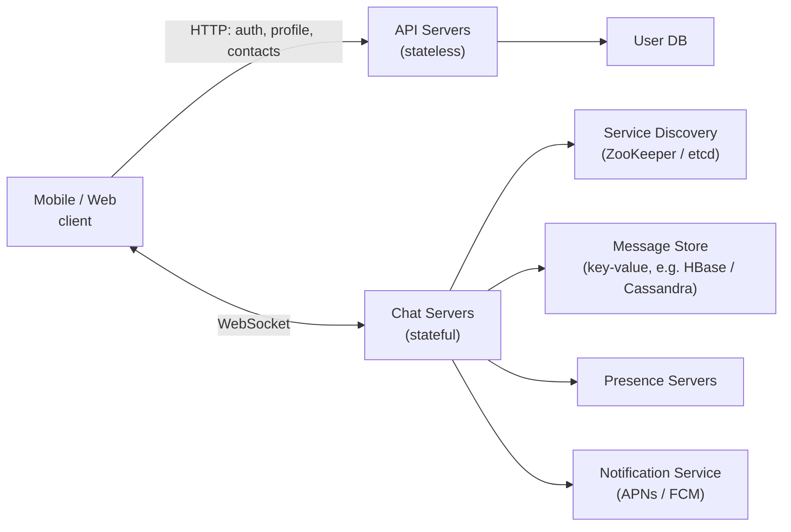
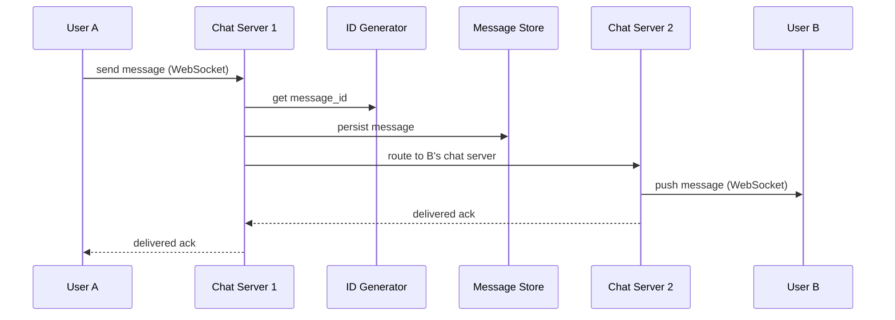
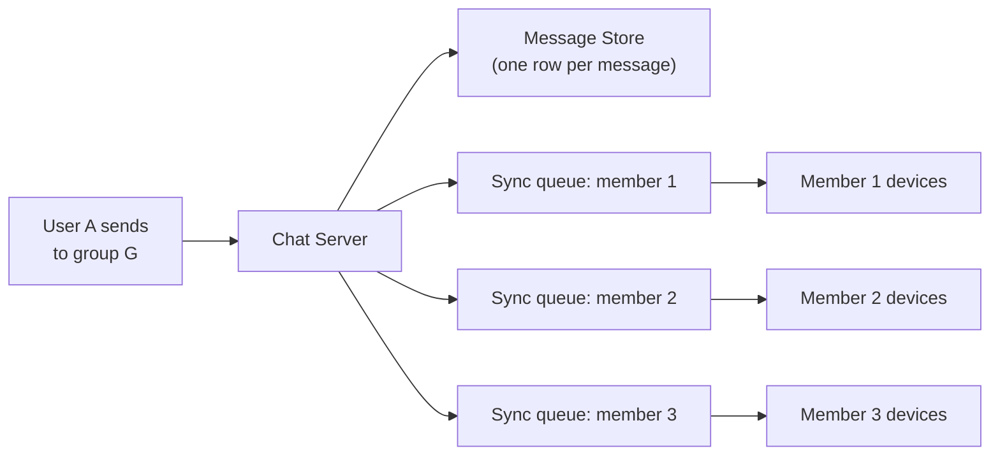
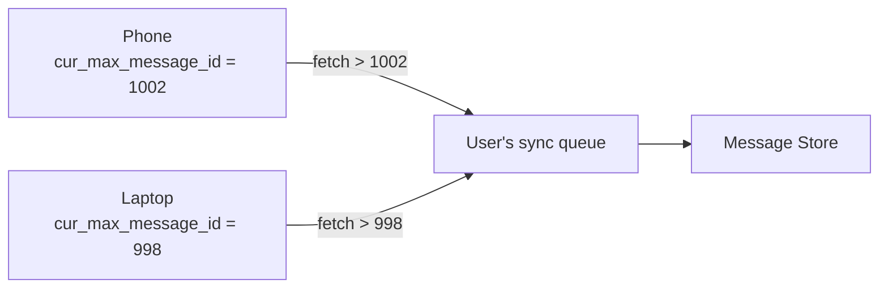

# Designing a Chat System

A chat system delivers messages between people in near real time — WhatsApp, Messenger, Slack, Discord, the DM tab of any social app. The product surface looks trivial: a text box and a list of bubbles. The system underneath is one of the most demanding designs in the book, because it inverts the usual web assumption: the **server** has to push to the **client**, and it has to do it for hundreds of millions of connections at once.

The hard parts are: holding **long-lived connections** at scale, ordering messages so every device sees the same conversation, syncing history to devices that were offline, and knowing who is **online** without melting your infrastructure with presence traffic.

---

## Brief

Scope this early — "chat" means very different systems depending on the answers.

Functional requirements:

- **1-on-1 chat** with low latency delivery
- **Small group chat** (say up to 100 members)
- **Online presence** — who is available right now
- Multi-device: the same account on phone, laptop, tablet, all in sync
- Push notifications when the recipient is offline
- Text-first; attachments (image, file) via a separate upload path
- Persist chat history forever, with pagination on scroll-back

Non-functional requirements:

- **Low latency** — sub-second end-to-end for an online recipient
- **High availability**, with graceful degradation: if presence breaks, messaging must not
- **Reliable delivery** — a sent message is never silently lost; at-least-once with client-side dedup
- **Consistent ordering** per conversation, across every device
- Scale to 50M DAU

Explicitly out of scope for a first pass: end-to-end encryption, video/voice calls, message reactions, threads, and read receipts beyond a simple delivered/read flag.

---

## Capacity (back-of-envelope)

50M DAU:

- Each user sends ~40 messages/day = 2B messages/day = **~23K messages/sec** average, ~5× peak = 115K/sec
- Average message row: ~100 bytes of text + metadata → 2B × 100 B = **200 GB/day**, ~73 TB/year (before replication)
- Concurrent WebSocket connections: assume 20% of DAU connected at once = **10M concurrent connections**
- A well-tuned box holds ~100K connections → **~100 chat servers** just for connection capacity, before headroom
- Presence updates are the sneaky cost: naive "broadcast my status to all friends on every heartbeat" with 300 friends and a 30s heartbeat is 500K presence fan-outs/sec at this scale. Design it down.

Connection count, not message throughput, is usually what sizes the fleet.

---

## Transport: How the Server Pushes

HTTP was built for client-initiated request/response. Chat needs the opposite. The options, in the order people historically tried them:

| Technique | How it works | Why it loses |
| --- | --- | --- |
| **Polling** | Client asks "anything new?" every N seconds | Wasted requests; latency bounded by the interval |
| **Long polling** | Client holds a request open until there's news or a timeout | Server can't tell if the client is gone; awkward with load balancers; a new request per message |
| **WebSocket** | One TCP connection, upgraded from HTTP, bidirectional and persistent | Nothing — this is the answer |
| **Server-Sent Events** | Server-push over HTTP, one direction only | Fine for feeds/notifications, but chat needs to send too |

**WebSocket** is the transport for the message path. Note what this does *not* mean: everything else in the system stays plain stateless HTTP. Login, signup, profile, contact list, and search all go through normal API servers. Only the message flow needs the persistent connection.

That split matters, because stateful and stateless services scale and deploy completely differently.

---

## High-Level Design



Three families of service, each with a different shape:

- **Stateless services** — auth, profile, contacts, group management. Behind a load balancer, autoscaled, boring.
- **Stateful service** — the chat servers. Each client is pinned to one server for the life of its connection, so these can't be treated as interchangeable.
- **Third-party integration** — push notifications for offline recipients.

### Components at a glance

| Component | Job |
| --- | --- |
| API servers | Everything that isn't the message path: login, contacts, group CRUD, search |
| Chat servers | Terminate WebSockets, send and receive messages, hold the client's session |
| Service discovery | Tells a connecting client which chat server to use (geography, capacity) |
| Message store | Append-only per-conversation message history |
| Message sync queues | Per-user inbox for devices that were offline |
| Presence servers | Track online/offline via heartbeats; fan out status changes |
| Notification service | Push to APNs/FCM when a recipient has no live connection |
| ID generator | Time-sortable per-conversation message IDs (see below) |

---

## Message Flow

### 1-on-1, both users online



The ordering here is deliberate: **persist before delivering**. If the store write fails, the sender gets an error and retries — better than a message that appeared on the recipient's screen and exists nowhere else.

### 1-on-1, recipient offline

Same path up to persistence. Then the chat server finds no live connection for B, so it:

1. Writes the message to B's **sync queue** (per-user inbox)
2. Calls the notification service to send a push via APNs/FCM
3. When B reconnects, the client pulls everything in its sync queue since its last-seen message ID

### Small group chat

For a group of N members, the sending server writes the message once and then puts a copy of the **message ID** into each recipient's sync queue:



This is fan-out on write again, and the tradeoff is identical to a [news feed](/system-design/basics/news-feed): fine for small groups, ruinous for a 100K-member channel. Above a threshold, switch the big rooms to fan-out on read — members pull the channel's recent messages instead of each getting their own inbox copy.

---

## Low-Level Design

### Service Discovery

A client cannot just hit `chat.example.com` and hope. It asks a discovery service (ZooKeeper, etcd, or a small purpose-built service) which chat server to connect to, based on:

- Geographic proximity — connect to the nearest region
- Current server capacity — don't pile onto a box at 95% connections
- Sticky affinity — reconnect to the same server when possible, so session state survives a blip

The discovery response is a host plus a short-lived token. The client then opens the WebSocket directly.

### Message Store: Why Key-Value

The access pattern is narrow and enormous:

- Writes are **append-only** and huge in volume
- Reads are almost always "the most recent N messages in this conversation," plus occasional scroll-back
- Random access by message ID is rare
- Nobody joins across conversations

That is a key-value / wide-column workload, not a relational one. Facebook Messenger used HBase; Discord famously moved to Cassandra and then ScyllaDB. Relational DBs are fine for the *metadata* (users, groups, membership) — just not for the message firehose.

Two tables, two key designs:

```text
1-on-1 message
  PK: message_id            (time-sortable)
  partition/index: channel_id  (deterministic per user pair)
  fields: from_id, to_id, content, created_at

group message
  PK: (channel_id, message_id)   -- composite: partition by channel
  fields: from_id, content, created_at
```

For group chat, `channel_id` is the partition key, because every read is scoped to a channel. That keeps one conversation's history physically together.

### Message IDs and Ordering

Ordering is where naive designs break. Requirements:

- IDs must be **unique**
- IDs must be **sortable by time**, so `ORDER BY id` equals chronological order

Notice what's *not* required: global ordering across the whole system. Ordering only has to hold **within one conversation**. That relaxation is what makes the problem tractable.

Options:

- **`auto_increment` in MySQL** — gives you sortable IDs but doesn't exist in NoSQL stores, and doesn't shard
- **Snowflake-style global generator** — 64-bit: timestamp + machine ID + sequence. Works, adds a dependency (see [Unique ID Generator](/system-design/basics/unique-id-generator))
- **Local sequence per channel** — a counter scoped to one conversation. Cheaper than a global generator and enough, precisely because cross-conversation order doesn't matter

Do **not** trust client timestamps for ordering. Clocks are wrong, clocks are adversarial, and a device with a skewed clock will pin its messages to the top or bottom of everyone's history forever.

### Message Synchronisation Across Devices

Every device tracks the largest message ID it has seen: `cur_max_message_id`. On connect, the device asks its sync queue for everything greater than that ID.



Each device therefore converges independently, and a device that was off for a week just does a larger fetch. Every device gets its own queue because each has its own high-water mark.

Queue size is bounded in practice: 1K messages per user inbox is a reasonable cap for a mobile client that's expected to reconnect; beyond that the device fetches history from the store instead of the queue.

### Presence

Presence looks like a small feature and is a genuine scaling trap.

**Going online** is easy — the WebSocket connects, the presence server flips a flag, and it fans out `status: online` to the user's friends via a pub-sub channel per friendship.

**Going offline** is the interesting half. A user can vanish in three ways: they log out, the app is backgrounded, or the network drops. Only the first is announced. So:

- The client sends a **heartbeat** every ~5 seconds while connected
- If the presence server sees no heartbeat for ~x seconds (say 30), it marks the user offline

Why not mark offline the moment the connection drops? Because mobile networks flap constantly. A user riding a train would flicker online/offline every few seconds, and each flip fans out to all their friends. The heartbeat window absorbs the flapping.

Fan-out control:

- Publish presence changes over **pub-sub channels**, one per friend pair — subscribers get updates without polling
- For users with huge friend/follow counts, **fetch presence on demand** instead: only resolve status for the contacts currently visible on screen
- Presence is the first thing you shed under load. It is decoration; messaging is the product.

### Attachments

Never stream file bytes through the chat servers — those servers exist to hold connections and should stay lean.

1. Client asks the API server for a pre-signed upload URL
2. Client uploads directly to blob storage (S3/GCS)
3. Client sends a chat message whose content is the object URL plus metadata (type, size, dimensions, thumbnail)
4. Recipients fetch the media through the CDN

---

## Reliability

### Delivery Guarantees

At-least-once, with client-side dedup on `message_id`. Exactly-once at this scale means either dropping messages or blocking on coordination; duplicates that the client silently swallows are the better trade.

Three acks, and they mean different things — don't conflate them in the UI:

| Ack | Means |
| --- | --- |
| **Sent** | The chat server persisted it |
| **Delivered** | It reached at least one of the recipient's devices |
| **Read** | The recipient's client reported the conversation open |

### Connection Failures

The client must treat disconnects as normal, not exceptional:

- Reconnect with **exponential backoff + jitter**, or 10M clients will resynchronise into a stampede after a network event
- On reconnect, re-run service discovery — the old chat server may be gone or full
- Re-sync from `cur_max_message_id`; never assume the gap is empty
- Queue outbound messages locally while disconnected and replay them, keying on a client-generated idempotency ID so retries don't double-send

### Chat Server Loss

Losing a chat server drops every connection it held. Clients reconnect elsewhere and sync. This is only survivable because the server holds **no durable state** — messages are already in the store before delivery, so a lost server costs a reconnect, not data.

---

## Scaling Considerations

### Connection Capacity

The fleet is sized by concurrent connections, not QPS. Each connection costs a file descriptor, socket buffers, and a little heap. Tuning that matters: raise `ulimit`/`somaxconn`, keep per-connection state tiny, and terminate TLS at the edge so chat servers spend their memory on sockets rather than crypto.

### Sharding

- **Message store** — partition by `channel_id`, so one conversation's history is co-located
- **Sync queues** — partition by `user_id`
- **Presence** — partition by `user_id`
- **Chat servers** — not sharded by data at all; a client is bound to a server by discovery, and any server can route to any other

### Multi-Region

Connect clients to the nearest region and route cross-region messages over a backbone. Conversations whose participants live in different regions need a home region per channel to keep ordering sane — pick one, replicate asynchronously elsewhere.

### Large Channels

The 100-member group and the 100,000-member channel are different products:

- Small groups: fan-out on write into per-member sync queues
- Large channels: fan-out on read — members pull recent messages; don't materialise 100K inbox copies for every message

---

## Common Failure Modes

| Failure | Symptom | Fix |
| --- | --- | --- |
| Client clock skew | One user's messages sort to the top of history forever | Server-assigned time-sortable IDs; never trust client timestamps |
| Presence flapping | Friends' status flickers; presence fan-out saturates | Heartbeat + 30s offline window instead of reacting to disconnects |
| Reconnect stampede | Network blip takes out the fleet on recovery | Exponential backoff with jitter, plus discovery-side capacity checks |
| Delivering before persisting | Recipient saw a message that no longer exists | Persist, then deliver |
| Unbounded sync queues | Storage and memory grow forever for lapsed users | Cap the queue; fall back to a history fetch from the store |
| Group fan-out on a huge channel | One message = 100K writes | Threshold switch to fan-out on read |
| Media through chat servers | Connection capacity collapses under file transfers | Pre-signed uploads direct to blob storage |
| Sticky sessions with no drain | Deploys drop every live connection at once | Drain connections gradually; clients reconnect via discovery |

---

## Backend Best Practices

- **WebSocket for the message path only.** Everything else stays stateless HTTP.
- **Persist before you deliver.** Always.
- Assign IDs **server-side**, time-sortable, unique per conversation.
- Give every device its own **high-water mark** and let it pull the delta.
- Treat **presence as optional** — degrade it first, never let it block messaging.
- Make the client **idempotent**: dedup on message ID, replay with a stable idempotency key.
- Keep chat servers **stateless in the durable sense** — a lost server should cost a reconnect and nothing more.
- Separate **small group** and **large channel** paths before the big channels exist, not after.
- Instrument **end-to-end delivery latency** (send → recipient device) and **connection churn** separately; they fail independently.

---

## Components Worth a Deeper Note

- [News Feed System](/system-design/basics/news-feed) — the same fan-out on write vs. read decision, one layer up
- [Notification Service](/system-design/basics/notification-service) — how the offline push actually gets delivered
- [Message Queues](/system-design/basics/message-queues) — what the sync queues are built on
- [Publish-Subscribe Pattern](/system-design/basics/pub-sub) — the presence fan-out model
- [Key-Value Store](/system-design/basics/key-value-store) — why the message store isn't relational
- [Unique ID Generator](/system-design/basics/unique-id-generator) — time-sortable `message_id`s
- [Stateless vs. Stateful](/system-design/basics/stateless-stateful) — the split that defines this design
