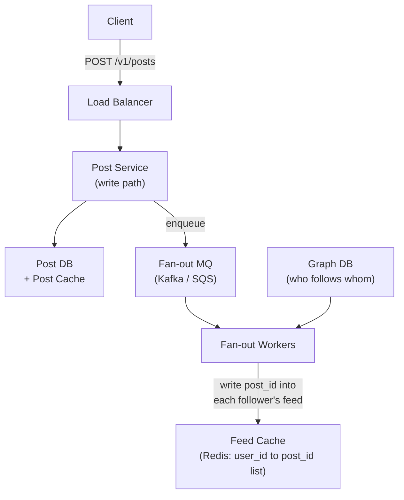
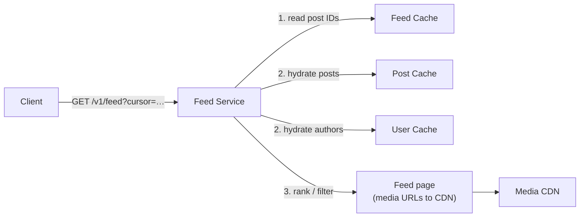

# Designing a News Feed System

A news feed is the constantly-updating list of posts on a user's home page — Facebook's feed, Twitter's timeline, Instagram's home, LinkedIn's feed. The user sees content from the people and pages they follow, ordered by recency or relevance, and they see it *fast*.

The interesting part is not "select posts from followed users order by time." It's that a single post by a popular account has to reach millions of feeds, while every one of those feeds has to load in **well under a second**. Those two requirements pull in opposite directions, and the whole design is about where you pay the cost: at **write time** or at **read time**.

---

## Brief

Functional requirements:

- **Feed publishing** — a user posts content (text, image, video); it appears in their own feed and in the feeds of all their friends/followers
- **Feed building** — assemble the home feed for a user, aggregating posts from everyone they follow
- Feed is paginated (infinite scroll), roughly reverse-chronological or ranked
- Support both directed follows (Twitter-style) and mutual friends (Facebook-style)

Non-functional requirements:

- **Read-heavy** — feed reads outnumber posts by ~100:1 or worse
- Feed load latency under ~200 ms for the first page
- High availability; eventual consistency is acceptable (a post being visible a few seconds late is fine)
- Scale to hundreds of millions of DAU
- Content ordering must be stable enough that pagination doesn't duplicate or skip posts

Out of scope (usually) but worth naming in an interview: ads insertion, ML ranking model training, content moderation.

---

## Capacity (back-of-envelope)

Assume 10M DAU:

- Each user posts ~2 times/day = 20M posts/day = **~230 posts/sec** average, ~1K/sec peak
- Each user opens the feed ~10 times/day = 100M feed reads/day = **~1.2K reads/sec**, ~5K/sec peak
- Average friends/follows per user: 300 → one post fans out to 300 feeds
- Fan-out writes: 230 posts/sec × 300 = **~70K feed-row writes/sec**
- Post metadata: ~1 KB → 20 GB/day of posts, ~7 TB/year (media stored separately in blob storage/CDN)
- Feed cache: keep ~500 post IDs per active user × 10M users × 8 bytes ≈ **40 GB** — fits comfortably in a Redis cluster

The 70K writes/sec number is the whole story: fan-out is where the load lives.

---

## High-Level Design

Two independent flows share a data layer.

### Feed Publishing



### Feed Building (read)



### Components at a glance

| Component | Job |
| --- | --- |
| Post service | Validates and persists a new post; publishes a fan-out event |
| Fan-out service (workers) | Resolves the author's followers and writes the post ID into their feed lists |
| Graph DB | Follower / friend edges — the input to fan-out |
| Feed cache | Per-user ordered list of post IDs (Redis sorted set or list) |
| Post cache / Post DB | The post bodies themselves, keyed by `post_id` |
| User cache | Author name, avatar, verified flag — needed to render every row |
| Media store + CDN | Images and video; the feed only stores URLs |
| Ranking service | Optional scoring layer between "list of IDs" and "what the user sees" |
| Notification service | Side effect of publishing (see below) |

---

## The Core Decision: Fan-out on Write vs. Fan-out on Read

This is the question the whole design hangs on.

### Fan-out on write (push model)

At post time, push the `post_id` into a precomputed feed list for every follower.

- **Read is trivially fast** — the feed is already materialized; one Redis range query
- **Real-time** — followers see the post as soon as fan-out completes
- **Write is expensive** — a user with 10M followers triggers 10M writes ("hotkey problem")
- **Wasted work** — you fan out to inactive users who may never log in again

### Fan-out on read (pull model)

At read time, fetch recent posts from everyone the user follows and merge them.

- **Write is cheap** — one row, done
- **No wasted work** for inactive users
- **Read is slow** — an N-way merge across hundreds of followees on every feed load
- Gets worse the more people a user follows

### Hybrid (what real systems do)

Push by default; **pull for celebrities**.

- Users under a follower threshold (say 100K) → fan-out on write
- Users above it → their posts are *not* fanned out. At read time, the feed service merges the precomputed feed with a small pull-based fetch of the few celebrities this user follows.
- Merge the two lists by timestamp/score and return.

The user follows maybe 3 celebrities, so the read-side merge is bounded and cheap, while the 10M-follower write storm never happens.

Extra refinements worth mentioning:

- **Only fan out to active users** — skip anyone who hasn't opened the app in 30 days; rebuild their feed lazily on next login
- **Fan out asynchronously** — the post write returns as soon as the event is enqueued; fan-out completing a few seconds later is fine

---

## Low-Level Design

### Post Service (write path)

1. Auth + validation; reject oversized or malformed payloads
2. Upload media to blob storage (usually a pre-signed URL directly from the client — don't proxy bytes through your API)
3. Generate a `post_id` — a time-sortable ID (Snowflake-style) so ordering falls out of the ID itself
4. Write the post row to the post DB; write-through to the post cache
5. Publish `{post_id, author_id, created_at}` to the fan-out queue
6. Return `201` — do not wait for fan-out

```http
POST /v1/posts
Authorization: Bearer <token>
{
  "content": "shipped the thing",
  "media": ["s3://.../a1b2.jpg"],
  "visibility": "followers"
}
```

```http
GET /v1/feed?limit=20&cursor=<opaque>
Authorization: Bearer <token>
```

Cursor-based pagination, never `OFFSET`. Offsets shift under you as new posts arrive, so page 2 duplicates rows from page 1. Encode the cursor as the last-seen `(score, post_id)`.

### Fan-out Workers

Pull an event, resolve followers, write. The properties that matter:

- **Stateless and horizontally scalable** — scale on queue depth
- **Batched writes** — one Redis pipeline per few thousand followers, not one round trip each
- **Chunked** — a 500K-follower fan-out becomes many small jobs so one message doesn't own a worker for minutes
- **Idempotent** — writing the same `post_id` into a sorted set twice is a no-op if you key by member, which is exactly why sorted sets are the right structure

### Feed Cache

The precomputed feed per user. Redis sorted set:

```text
key:    feed:{user_id}
member: post_id
score:  created_at  (or ranking score)
```

Design notes:

- **Cap the list** — trim to the newest ~500–1000 entries. Nobody scrolls past that; if they do, fall back to a DB query.
- **Store IDs, not bodies** — a post appearing in 300 feeds should exist once. Storing full posts multiplies memory by the fan-out factor and makes edits impossible to propagate.
- **Shard by `user_id`** so one user's feed lives on one node and a range read is a single round trip.

### Feed Service (read path)

1. Range-read the top N `post_id`s from `feed:{user_id}`
2. Merge in celebrity posts (pull path) for followed high-fan-out accounts
3. Multi-get post bodies from the post cache; batch-fetch author metadata from the user cache
4. Filter — blocked users, deleted posts, muted keywords, visibility rules
5. Rank if applicable
6. Return with media URLs pointing at the CDN

Steps 3 and 4 are where the N+1 query problem hides. Everything must be a batch call.

### Ranking

Chronological is the honest default and a fine interview answer. If asked for relevance ranking:

- Score = f(recency, affinity to author, engagement rate, content type, predicted interaction)
- Compute at read time over the ~500 candidate IDs — cheap, and lets you re-rank without rewriting stored feeds
- Store the model's score in the sorted set only if ranking is precomputed; otherwise keep the score as the timestamp and re-sort in the feed service

### Caching Layers

Feeds are the most cacheable workload in a product. Typical stack:

| Layer | Holds | Notes |
| --- | --- | --- |
| Feed cache | `user_id` → post IDs | The materialized timeline |
| Post cache | `post_id` → post body | Highest hit rate in the system |
| User cache | `user_id` → name, avatar | Read on every single row |
| Social graph cache | `user_id` → followee IDs | Feeds the pull path and fan-out |
| Counter cache | likes / comments / shares | Hot, write-heavy, eventually consistent |
| CDN | images, video | Never serve media from your origin |

---

## Data Model

```text
posts        (post_id PK, author_id, content, media_urls, created_at, visibility)
follows      (follower_id, followee_id, created_at)   -- PK (follower_id, followee_id)
follows_rev  (followee_id, follower_id)               -- reverse index for fan-out
users        (user_id PK, name, avatar_url, follower_count, ...)
```

`follows` is queried both directions and neither direction is optional:

- **"Who do I follow?"** — the pull path and the profile page
- **"Who follows me?"** — fan-out, and this is the hot one

Keep both indexes, or use a graph store. `follower_count` on the user row is what the hybrid model reads to decide push vs. pull, so keep it denormalized and roughly fresh.

---

## Scaling Considerations

### Hot Keys / Celebrities

Covered above by the hybrid model, but the same shape recurs: a post that goes viral concentrates reads on one `post_id`. Fix with a local in-process cache in front of Redis for the top-K posts, plus request coalescing so a cache miss triggers one DB read, not ten thousand.

### Sharding

- **Posts** — shard by `post_id` (time-sortable IDs spread naturally if you hash, or cluster by time if you range-shard and accept a hot shard)
- **Feed cache** — shard by `user_id`
- **Graph** — shard by `follower_id`; the reverse index by `followee_id`. Note this means fan-out reads cross shards, which is why the reverse index exists as its own table.

### Multi-Region

Feeds are read-locally-heavy. Replicate post and user caches to each region, and keep feed caches region-local for the users homed there. Fan-out events cross regions over the same message bus. Accept a few seconds of cross-region lag.

### Backfill and Rebuild

Feed caches are derived data, which means you must be able to rebuild them:

- New follow → backfill the follower's feed with the followee's recent posts
- Cache node loss → rebuild lazily on first read from the graph + post DB
- Ranking change → recompute scores over stored IDs

Anything you can't rebuild from the source of truth is a liability.

---

## Common Failure Modes

| Failure | Symptom | Fix |
| --- | --- | --- |
| Celebrity fan-out | Write queue backs up for minutes; feeds go stale | Hybrid push/pull above a follower threshold |
| Offset pagination | Duplicate or missing posts on scroll | Cursor pagination keyed by `(score, post_id)` |
| Deleted post still in feeds | Ghost rows, or empty gaps | Filter on hydration (feed stores IDs, so the body is the truth); tombstone in the post cache |
| N+1 hydration | Feed p99 blows past a second | Batch multi-get for posts, authors, and counters |
| Unbounded feed lists | Redis memory grows without limit | Trim to N entries; page beyond N from the DB |
| Fan-out to inactive users | Most write work is wasted | Active-user filter + lazy rebuild on login |
| Thundering herd on a viral post | One post melts a cache shard | Local cache + request coalescing |

---

## Backend Best Practices

- Make the write path **async past the durable write** — persist the post, enqueue fan-out, return.
- Store **IDs in feeds, bodies in caches**. Denormalizing post content into every feed makes edits and deletes unfixable.
- Use **time-sortable IDs** so ordering and cursors come for free.
- Treat every derived structure as **rebuildable** — feeds, counters, ranking scores.
- **Cap and trim** anything per-user and unbounded.
- Batch everything on the read path; a feed row is 4+ lookups and there are 20 rows per page.
- Decide push vs. pull with a **measured threshold**, not a guess, and make it a config value you can move.
- Instrument feed **staleness** (time from post to visible) separately from feed **latency** — they fail independently.

---

## Components Worth a Deeper Note

- [Message Queues](/system-design/basics/message-queues) — the fan-out bus
- [Workers in Message Queues](/system-design/basics/workers) — how fan-out workers consume
- [Publish-Subscribe Pattern](/system-design/basics/pub-sub) — the event model behind publishing
- [Notification Service](/system-design/basics/notification-service) — the other side effect of a new post
- [Key-Value Store](/system-design/basics/key-value-store) — what the feed and post caches are built on
- [Unique ID Generator](/system-design/basics/unique-id-generator) — time-sortable `post_id`s
- [High-Level Architecture](/system-design/basics/high-level-architecture) — load balancers, CDN, cache tiers
