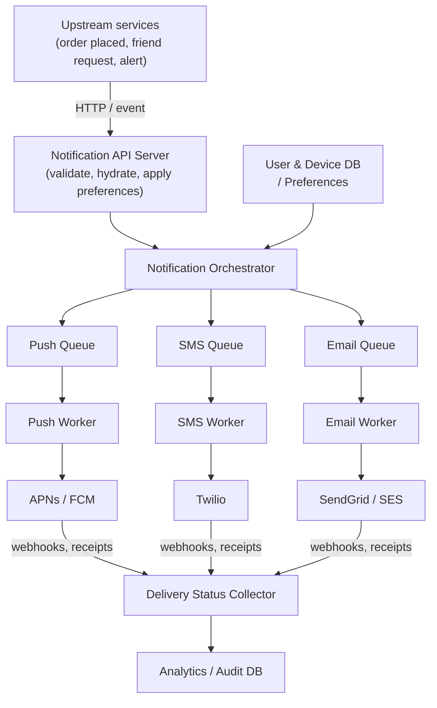

# Designing a Notification Service

A notification service is the platform that delivers messages from your backend to users — push, SMS, email, and (sometimes) in-app — at scale, reliably, and with the right delivery guarantees. Almost every consumer product has one, and "send an email when X happens" is deceptively the gateway to a real distributed system.

The hard parts are not "call an API." They are: handling **third-party flakiness**, getting **fan-out and rate limiting** right, supporting **multiple channels** with one interface, and giving the rest of the company a clean **template + preferences** story.

---

## Brief

Notification types we need to support:

- **Push** — iOS (APNs), Android (FCM), web push
- **SMS** — Twilio, Nexmo/Vonage, AWS SNS
- **Email** — SendGrid, Mailgun, SES
- **In-app** — own datastore, surfaced by clients via WebSocket / polling

Functional requirements:

- Send notifications to a single user, a group of users, or a broadcast
- Support all four channels above
- Respect per-user channel preferences
- Don't spam: deduplicate, rate-limit per user
- Provide delivery status (sent / failed / bounced) back to upstream

Non-functional requirements:

- High availability — notifications are often time-sensitive
- Low end-to-end latency (seconds, not minutes)
- Reliable: at-least-once delivery for important notifications, with retries
- Scalable: 10M+ notifications/day is typical for a mid-size product
- Observable: tracing per notification so support can investigate "I didn't get it"

---

## Capacity (back-of-envelope)

Mid-size product, 10M daily active users:

- 10 notifications per user per day (mix of all channels)
- = 100M notifications/day = ~1.2K notifications/sec average
- Peak (campaigns, news events): 10× = 12K/sec
- Average payload size: 1 KB
- Storage for in-app feed + audit log: ~100 GB / month (with TTL)
- Third-party API call rate must stay under provider quotas (FCM: 600K msg/min; Twilio per-account per-second limits)

---

## High-Level Design



### Why per-channel queues

A single shared queue would be a disaster. Each provider has its own quotas, latencies, and failure modes — if Twilio throttles for 5 minutes, you don't want that to also block push notifications from going out. Separate queues = separate failure domains.

### Components at a glance

| Component | Job |
| --- | --- |
| Notification API server | Public entry point; validates request, hydrates user data, applies preferences |
| Notification orchestrator | Fans out to channel queues based on preferences + content |
| Channel queues | Per-channel buffer (push / SMS / email / in-app) |
| Channel workers | Pull from queue, call third-party, handle retries |
| User & device DB | Stable user IDs → device tokens, email, phone, preferences |
| Template store | Versioned, localized message templates |
| Delivery status collector | Ingests webhooks/receipts from providers; updates audit DB |
| Analytics & audit DB | Per-notification trace: sent, delivered, opened, failed |
| Rate limiter | Per-user, per-channel, per-template throttle |

---

## Low-Level Design

### Notification API Server

Public entry. Three responsibilities, in order:

1. **Auth + input validation** — only trusted upstream services can call it. Reject malformed payloads.
2. **Idempotency** — every request carries a `notification_id` (UUID). Repeated calls with the same ID are no-ops. Crucial because upstream services retry on timeouts.
3. **Hand off** — drop the request into the orchestrator queue and return `202 Accepted` fast. Don't do delivery synchronously.

API shape:

```http
POST /v1/notifications
{
  "notification_id": "uuid",
  "user_ids": ["u1", "u2"],
  "template_id": "order_shipped_v3",
  "params": { "order_id": "1234", "carrier": "UPS" },
  "channels": ["push", "email"],
  "priority": "normal"
}
```

### Notification Orchestrator

The brain. For each `(user, channel)` pair:

- Load user preferences (does this user want this kind of notification on this channel?)
- Look up device tokens / email / phone from the user DB
- Render the template with `params` and the user's locale
- Apply rate-limit / dedup checks
- Push the per-channel payload onto the channel's queue

If a notification needs three channels (push + SMS + email), the orchestrator creates three separate messages, one per channel queue. Each one is delivered independently.

### Channel Queues

One queue per channel — usually Kafka topics or RabbitMQ queues. Per-queue tuning:

- **Push:** highest throughput, lowest latency target (sub-second)
- **SMS:** slower, costlier; backpressure matters
- **Email:** highest tolerance for delay; batching is fine
- **In-app:** writes go to your own datastore, no third party

Per-channel queues also let you scale workers independently.

### Channel Workers

Pull from a queue, call the third-party provider, handle the response.

Important properties:

- **Stateless** — any worker can pick up any message
- **Idempotent** — uses `notification_id` so retries don't double-send
- **Retry policy** — exponential backoff for transient errors (5xx, timeouts); give up after N attempts and move to a **dead-letter queue (DLQ)** for inspection
- **Provider client** wraps timeout, circuit breaker, and quota awareness
- **Fan-out for push** — one push message might target multiple devices for one user

### User & Device DB

Stores the boring-but-critical mappings:

```text
user_id  → email, phone, locale, timezone, preferences[]
user_id  → device_tokens[]   (one row per device, with platform + last_seen)
```

Schema notes:

- **Device tokens churn**: rotate on app reinstall, OS upgrades. Mark stale on provider feedback (FCM/APNs both return "not registered" errors).
- **Preferences** are per (category × channel): e.g., "marketing emails: off, security emails: on."
- Read-heavy; cache aggressively (Redis) keyed by `user_id`. Cache invalidation on profile change.

### Template Store

Templates live separately from the senders so non-engineers can change copy without a deploy.

| Field | Purpose |
| --- | --- |
| `template_id` | Stable key referenced by senders |
| `version` | Append-only; can roll back |
| `locale` | One template per language |
| `channel` | Channel-specific body (push has char limits, email has HTML) |
| `subject` | Email subject / push title |
| `body` | Mustache / Handlebars template |
| `metadata` | Required params, A/B variants, etc. |

Versioning + locale matter more than people expect. "Send notification" with no version control means every typo fix is risky.

### Rate Limiter

Stops one of:

- **Per user** — no more than N pushes per hour, no more than M emails per day. Prevents spam, respects platform guidelines (APNs penalizes spam apps).
- **Per template** — campaigns can't bomb the queue
- **Per provider** — keep us under FCM/Twilio/SendGrid quotas
- **Per app version** — back off if a buggy client is registering 1000 tokens

Two common algorithms (covered in detail in the [Rate Limiter](/system-design/basics/rate-limiter) note): **token bucket** and **sliding-window counter**. Redis-backed counters keyed by `(user_id, channel)` with TTL.

When the limiter fires, the orchestrator can either **drop**, **delay** (re-enqueue with a future visibility timestamp), or **batch** (merge multiple into one digest). Pick per-template.

### Deduplication

Two layers:

1. **Hard dedup** — based on `notification_id`. Same ID = exact same notification. Use Redis with a TTL of a few hours.
2. **Soft dedup** — same user, same template, same params, within a window. Catches accidental double-fires from upstream services. Hash `(user_id, template_id, sha256(params))` and keep recent hashes in Redis.

### Delivery Status Collector

Providers tell you what happened, but **asynchronously**, via webhooks:

- SendGrid: `delivered`, `bounce`, `dropped`, `spamreport`
- Twilio: `queued`, `sent`, `delivered`, `failed`, `undelivered`
- APNs / FCM: per-token error feedback ("not registered", "invalid token", etc.)

The collector is a simple webhook endpoint that:

- Validates the signature (every provider has one — use it)
- Looks up `notification_id` ↔ provider-side ID mapping (stored when the worker dispatched the message)
- Updates the audit DB
- Removes invalid device tokens / unsubscribes bounced emails

### Analytics & Audit DB

Two tables, two purposes:

- **Audit** — per-notification trace: when sent, channel, attempts, final status, provider response. Used by support ("I didn't get my OTP") and compliance.
- **Analytics** — aggregated: delivery rate by channel, click-through by template, etc. Usually a separate columnar store (BigQuery, Redshift) populated by CDC or batch ETL.

Audit is high-write, read-rare. TTL ~90 days for non-regulated traffic.

---

## Reliability Patterns

### At-Least-Once Delivery

The default guarantee. Workers ack messages only after the provider returns success. If a worker crashes mid-call, the message is re-delivered, which is why **idempotency at the provider** matters (or your own dedup layer must catch it).

Exactly-once is mostly a lie at this scale — you trade duplicates for losses or vice versa.

### Retries with Backoff

```text
attempt 1 → fail → wait 1s
attempt 2 → fail → wait 5s
attempt 3 → fail → wait 30s
attempt 4 → fail → wait 5m
attempt 5 → fail → DLQ
```

Jitter the delays so a transient provider outage doesn't cause a thundering herd when it recovers.

### Circuit Breaker

Per-provider client tracks success rate over a window. If it dips below a threshold, the breaker **opens** — all subsequent calls fail fast for ~30s, queue depth grows but the provider isn't pounded with traffic it can't handle. After the cool-down, the breaker enters **half-open**, lets one call through, and decides whether to close.

Stops a flaky provider from cascading into queue saturation.

### Dead-Letter Queue (DLQ)

Where messages go after exhausting retries. Operators inspect, fix, and re-drive. DLQ entries include the original payload, all attempt traces, and the final error.

### Outbox Pattern (upstream)

The hard problem with "publish a notification when an order ships": the order-shipped DB write and the notification publish need to either both happen or neither. Solution:

- Upstream service writes the order update + a row in an `outbox` table in **one transaction**.
- A separate job (CDC or polling) reads the outbox and publishes to the notification API.

Without this, you'll see notifications without the matching state or vice versa.

---

## Scaling Considerations

### Horizontal Scaling

Everything stateless scales horizontally:

- API servers behind a load balancer
- Channel workers — N workers per queue, auto-scaled on queue depth
- Rate limiter (Redis) and dedup store (Redis) — sharded or clustered

The DB and the provider quotas are the usual bottlenecks.

### Hot Users / Hot Topics

A celebrity has 10M followers. A goal in a World Cup match triggers tens of millions of "your team scored" notifications simultaneously.

Techniques:

- **Fan-out at write vs. read** — store the event once and let clients pull, instead of pushing to each follower. Tradeoff: in-app vs. push.
- **Sharded fan-out workers** — partition by user_id so one hot follower-graph fragment doesn't melt one worker
- **Pre-computed audience cohorts** for known broadcast targets

### Geo-Distribution

Pin workers and queues to the same region as the third-party endpoint:

- US workers → Twilio US, FCM US-Central
- EU workers → Twilio EU, SendGrid EU

Reduces latency and respects data-residency requirements (GDPR).

### Priority Lanes

Two queues per channel: **high-priority** (OTP, security alerts) and **normal** (digests, marketing). Workers drain high-priority first. OTP delivery missing its 30-second SLA because a marketing blast is in front of it = embarrassing.

---

## Security & Compliance

- **Don't log PII** in notification bodies. Audit logs should reference template ID and params hash, not the rendered text.
- **Encrypt provider credentials** at rest and rotate often.
- **Unsubscribe links** are legally required for marketing emails (CAN-SPAM, GDPR, CASL).
- **OTP / 2FA** notifications: rate-limit aggressively, never log the OTP itself, mark them ephemeral.
- **Quiet hours** — respect the user's timezone for non-urgent notifications.
- **Provider compliance**: APNs requires production vs. sandbox cert separation; FCM has its own server-key model; both will revoke if abused.

---

## Common Failure Modes

| Failure | Symptom | Fix |
| --- | --- | --- |
| Provider down | Queue depth spikes | Circuit breaker + DLQ + alert |
| Bad template | Every notification of one type fails | Versioning + canary rollout |
| Token churn after iOS update | Push delivery rate drops 30% overnight | Honor provider "unregistered" feedback |
| Spammy upstream service | One user gets 50 emails | Per-user rate limit + soft dedup |
| Email landing in spam | Open rate craters | SPF/DKIM/DMARC, separate sending IPs for marketing vs. transactional |
| Cross-channel duplication | User gets push + SMS + email of same thing | Preference resolution at orchestrator level |

---

## Backend Best Practices

- Always make the API **idempotent** with `notification_id`.
- Separate **transactional** (OTP, password reset) and **marketing** sending paths — different SLAs, different IP pools, different DBs even.
- Store the **provider message ID** with the audit row so you can join webhook events back.
- Cache user preferences hot; invalidate on writes.
- Treat third-party providers as **unreliable** — circuit-break and DLQ everything.
- Version your **templates**, never hot-edit production copy.
- Build **observability** in from day one: per-notification trace, p50/p95/p99 latency per channel, success rate per provider.
- Test **failure modes**, not just happy path — simulate provider 500s, slow webhooks, expired tokens.

---

## Components Worth a Deeper Note

- [Message Queues](/system-design/basics/message-queues) — what's behind each channel queue
- [Workers in Message Queues](/system-design/basics/workers) — how channel workers consume
- [Rate Limiter](/system-design/basics/rate-limiter) — the algorithm choices for per-user throttles
- [Publish-Subscribe Pattern](/system-design/basics/pub-sub) — fan-out from upstream events
- [Unique ID Generator](/system-design/basics/unique-id-generator) — generating `notification_id` at scale
