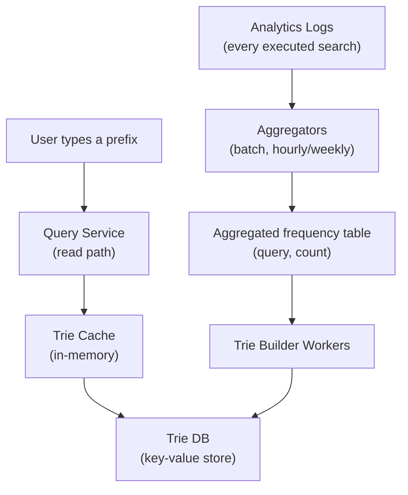
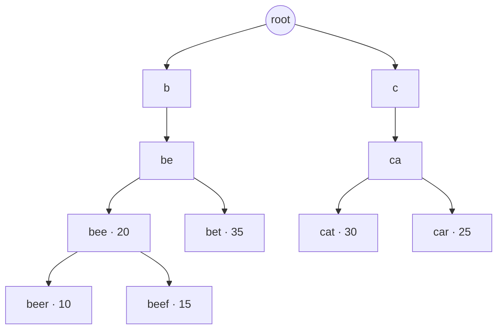
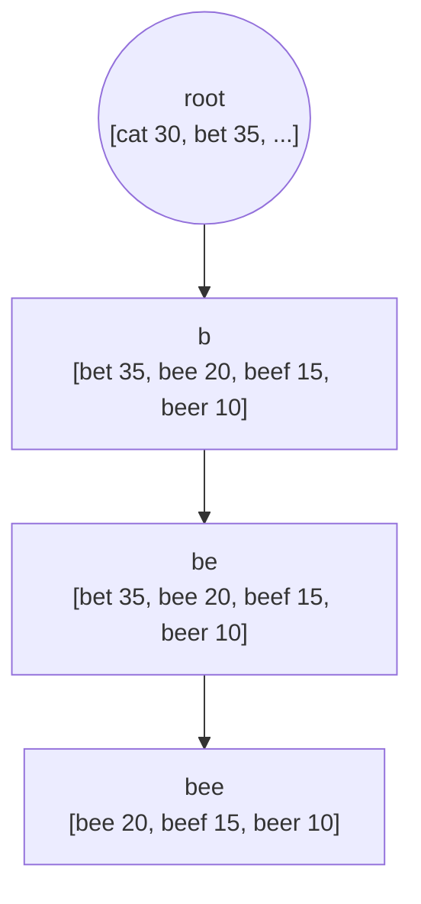
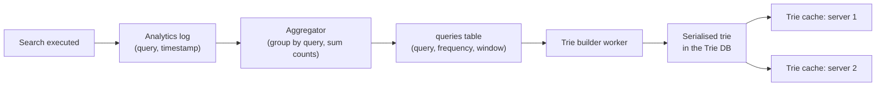
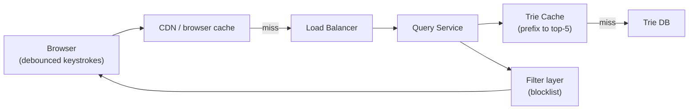
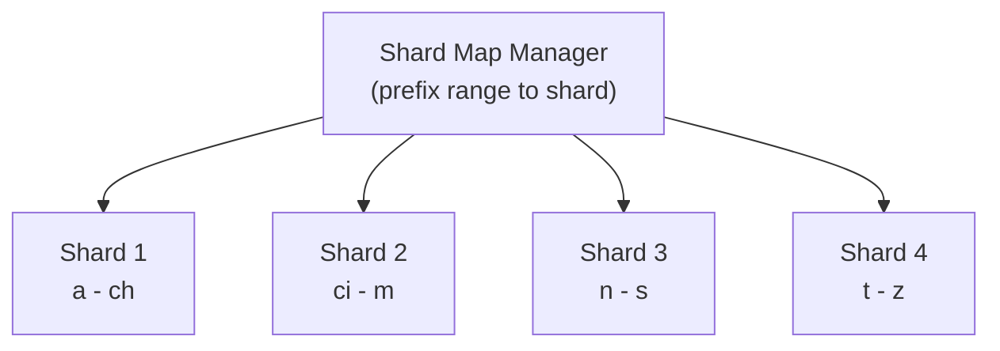

# Designing a Search Autocomplete System

Search autocomplete — typeahead, incremental search, "search as you type" — is the dropdown of suggestions that appears under a search box while you're still typing. Google, Amazon, and every in-app search bar have one.

It looks like a lookup and is really a latency problem. The user types `d`, `di`, `din`, `dinn` — that's a request **per keystroke**, each of which must return before the next keystroke lands, or the dropdown feels laggy and people stop looking at it. The design is therefore dominated by two questions: what data structure answers "top 5 completions for this prefix" fast enough, and how do you keep it fresh without rebuilding it on the write path.

---

## Brief

Scope it tightly — the naive reading of "autocomplete" is enormous.

Functional requirements:

- Return the **top 5** most popular queries starting with the typed prefix
- Suggestions ranked by **historical query frequency**
- Results are prefix-only — no spell correction, no fuzzy matching, no autocorrect
- English only, lowercase, no punctuation handling
- Suggestions update over time as query popularity shifts

Non-functional requirements:

- **Fast** — under ~100 ms end to end, or the dropdown lags behind typing
- **Relevant** — suggestions have to match what people actually search for
- **Sorted** — by popularity, not alphabetically
- **Scalable** — traffic is a multiple of search traffic, since every keystroke is a request
- **Highly available** — degrade to no suggestions, never to a broken search box

Explicitly out of scope for a first pass: personalisation, per-user history, multi-language, trending/real-time queries (that's a genuinely different design — see the end).

---

## Capacity (back-of-envelope)

10M DAU:

- Each user runs 10 searches/day = 100M searches/day
- Average query is ~4 words × 5 chars ≈ **20 characters**, so ~20 requests per search
- 100M × 20 = 2B autocomplete requests/day = **~24K QPS** average, ~48K QPS peak
- Query strings are small: 20 bytes each. 100M searches/day × 20 B = **2 GB/day** of raw query logs
- Roughly 20% of daily queries are new, so the dataset grows ~0.4 GB/day
- The whole trie for a mature dataset is single-digit gigabytes — it fits in memory, which is the reason this design works at all

The 20× amplification from keystrokes is the number to say out loud in an interview. It's what makes autocomplete more read-heavy than search itself.

---

## High-Level Design

Two subsystems that share a data store and are otherwise completely independent:



- **Data gathering service** — consumes the log of executed searches, aggregates them into `(query, frequency)` counts, and periodically rebuilds the trie.
- **Query service** — given a prefix, returns the top 5. This path touches nothing but memory.

The split matters: **the write path never touches the read path**. Suggestions come from a structure that was built offline, so a spike in searches can't slow down the dropdown.

### Components at a glance

| Component | Job |
| --- | --- |
| Analytics logs | Append-only record of every executed search query |
| Aggregators | Roll raw logs up into `(query, frequency)` over a time window |
| Trie builder workers | Build the trie from the aggregated table on a schedule |
| Trie DB | Persistent home for the serialised trie (key-value store) |
| Trie cache | The in-memory copy the query service actually reads |
| Query service | Prefix → top 5, nothing else |
| Filter layer | Drops offensive, legally risky, or blocklisted suggestions |

---

## The Data Structure: Trie

A relational query is the obvious first idea and the obvious first thing to reject:

```sql
SELECT query, frequency FROM queries
WHERE query LIKE 'din%'
ORDER BY frequency DESC LIMIT 5;
```

At 24K QPS over hundreds of millions of rows, a leading-wildcard `LIKE` is a table scan. Not viable.

A **trie** (prefix tree) is the right shape: each node is a character, each path from the root spells a prefix, and each terminal node carries the query's frequency.



Lookup is then: walk to the prefix node, collect every descendant, sort by frequency, take 5.

### Why the naive trie is still too slow

Let `p` = prefix length, `n` = total nodes under that prefix, `c` = children collected.

- Walk to the prefix node: **O(p)**
- Traverse the whole subtree: **O(n)**
- Sort the results: **O(c log c)**

The problem is a short, popular prefix. Type `a` and the subtree beneath it is effectively the entire dataset — hundreds of millions of nodes traversed, per keystroke, at 24K QPS.

### Optimisation 1: Cache top-k at every node

Store the top 5 completions **on each node**, precomputed when the trie is built.



Lookup collapses to: walk `p` nodes, read the cached list, return it. **O(p)** with a tiny constant — and since prefixes are short, that is effectively O(1).

The cost is memory (every node stores 5 strings) and build time. Both are fine, and this is the trade the whole design rests on: **spend space and offline compute to make the online read trivial**.

### Optimisation 2: Limit prefix length

Cap prefixes at ~50 characters. Nobody types a 200-character search, and the cap bounds `p` so the walk is genuinely constant time.

---

## Data Gathering

The trie is derived data. Building it is a batch job, and how often you run it is a product decision, not a technical one.



Notes that matter:

- **Aggregate before building.** Raw logs are per-search rows; the builder wants `(query, frequency)`.
- **Weekly is fine for general search.** Popular queries move slowly. Daily or hourly for faster-moving catalogues.
- **Build offline, swap atomically.** Workers construct a whole new trie, write it to the trie DB, and servers load it and switch over. Never mutate the live trie in place — a half-updated trie serves garbage.
- **Time-windowed counts** let you weight recent behaviour more heavily than a query that was popular three years ago.

### Storing a trie in a key-value store

A trie is a pointer structure and a key-value store is flat, so you serialise it: **key = prefix, value = the node's top-k list**.

```text
"be"   → ["bet", "bee", "beef", "beer"]
"bee"  → ["bee", "beef", "beer"]
"beer" → ["beer"]
```

That's the whole trick — because every node already caches its top-k, the tree structure isn't needed at query time. The query service does a single key lookup on the prefix. The trie shape only exists during the build.

---

## Query Path



Front-end work does as much for perceived latency as anything on the server:

- **Debounce** — don't fire on every keystroke; wait ~50 ms of quiet. Cuts request volume hard with no perceived cost.
- **Browser cache** — suggestions for a prefix barely change between keystrokes within one session. Cache them client-side with a short TTL.
- **AJAX, not navigation** — the dropdown never reloads the page.
- **Cancel in-flight requests** when a newer keystroke supersedes them, or a slow response for `di` can land after `dinn` and repaint stale suggestions.

---

## Scaling the Trie

One server's memory is the first limit. Sharding by first character is the obvious move and the obvious trap.

### Naive sharding

26 shards, one per starting letter (`a`, `b`, … `z`). Simple, and badly unbalanced: far more English queries start with `s` or `c` than with `x`, `z`, or `q`.

### Sharding with a shard map manager

Keep a **shard map** — a lookup of prefix ranges to shards — built from the observed distribution:



Heavy prefixes get split further (`s` alone might warrant its own shard, or several). The map is small, rarely changes, and can live in ZooKeeper or a config service. Rebalancing is a config push plus a trie rebuild — not a migration.

### Replication

Every shard is read-only at serving time, which makes replication trivial: run N identical replicas per shard behind a load balancer and scale them independently by traffic. There is no write coordination to worry about, because writes only happen during the offline build.

---

## Real-Time Autocomplete

Everything above assumes suggestions can be hours or days stale. That's true for general search and false for anything trend-driven — Twitter during a live event, a news site, a marketplace during a flash sale.

Real-time changes the design materially:

- **Reduce the trie's working set** — shard more aggressively so any single trie is small enough to rebuild quickly
- **Change the ranking weights** — decay old counts sharply so a query trending today outranks an evergreen one
- **Stream instead of batch** — feed queries through a streaming pipeline (Kafka → Flink/Storm) that updates counts continuously
- **Accept approximation** — count-min sketch or similar probabilistic counters give "roughly how hot is this query" in bounded memory, which is all ranking needs

Say plainly in an interview that this is a different system rather than a tuning knob on the batch one.

---

## Filtering and Safety

Autocomplete puts words in a user's mouth, which makes it a reputational and legal surface, not just a feature:

- Maintain a **blocklist** applied at query time, not just build time — you want a bad suggestion gone in minutes, not at the next rebuild
- Filter at the **serving layer** so it applies to every trie version
- Strip suggestions that are defamatory about real people, or that pair a named entity with an accusation
- Drop queries below a **minimum frequency** — a suggestion seen 3 times is noise and may leak one person's private search

---

## Common Failure Modes

| Failure | Symptom | Fix |
| --- | --- | --- |
| Traversing the subtree per request | p99 collapses on short prefixes like `a` | Cache top-k at every node during the build |
| Mutating the live trie | Suggestions briefly garbage during rebuild | Build a new trie offline, swap atomically |
| Sharding by first letter | One shard hot, others idle | Shard map built from the observed prefix distribution |
| No request cancellation | Stale suggestions repaint over newer ones | Cancel superseded requests; ignore out-of-order responses |
| No debounce | Request volume 20× search traffic for nothing | Debounce ~50 ms client-side |
| Long-tail queries surfacing | Rare, private, or offensive strings suggested | Minimum-frequency threshold + serving-time blocklist |
| Trie DB on the request path | Latency spikes when the cache misses | Load the whole trie into memory at startup; the DB is for durability |

---

## Backend Best Practices

- Precompute at **build time** what you'd otherwise compute per request. That's the whole design.
- Keep the **read path in memory** — a prefix lookup should never touch disk or a network DB.
- Treat the trie as **derived and rebuildable**; the analytics log is the source of truth.
- **Swap, don't mutate.** New trie, atomic switch, keep the old one until the new one is serving.
- Do the client-side work — **debounce, cache, cancel** — before you scale the backend for traffic you didn't need.
- Shard on the **measured distribution**, never on the alphabet.
- Put the **blocklist at serving time**, so removing a bad suggestion doesn't wait for a rebuild.
- Instrument **suggestion latency** and **suggestion click-through** separately: fast but irrelevant suggestions look healthy on a latency dashboard and are useless.

---

## Components Worth a Deeper Note

- [Key-Value Store](/system-design/basics/key-value-store) — where the serialised trie lives
- [High-Level Architecture](/system-design/basics/high-level-architecture) — load balancers, CDN, and cache tiers on the query path
- [Workers in Message Queues](/system-design/basics/workers) — how the trie builder jobs are scheduled
- [Message Queues](/system-design/basics/message-queues) — the log pipeline feeding the aggregators
- [Web Crawler](/system-design/basics/web-crawler) — the other side of search: how the corpus gets collected
- [Rate Limiter](/system-design/basics/rate-limiter) — protecting a 24K QPS endpoint from abuse
